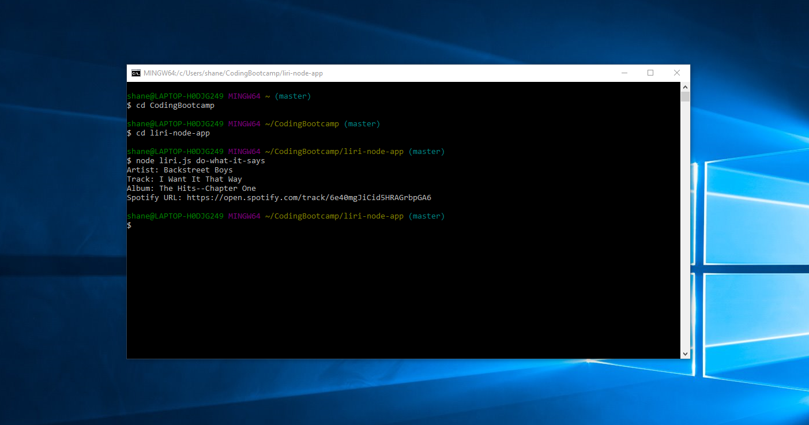

# **LIRI Node App**

The LIRI bot is a node application that allows the user to display information based on the command line inputs.

The user may look for data such as:

1. Concert events for an artist

2. Song information on Spotify

3. Movie information

4. Randomly generated information from any of the previous 3 categories.

In order to use the application you must first type the the words "node" and then "liri.js". These will both let the terminal know that you are accessing this LIRI bot application.

Next you must enter the command for the information you are looking for. Commands can be:

1. "concert-this" - to look for artist event information.

2. "spotify-this-song" - to look for specific song information on Spotify.

3. "movie-this" - to look for movie information based on title.

4. "do-what-it-says" - to have a random piece of information pop up from either of the 3 categories.

After you type one of the commands, you may enter whatever information you are looking for, such as, artist name, song title, or movie title.

Here are a few examples with their output:

## **Concert This**

In this example, I am searching for concert dates for the band "The Menzingers". Their upcoming events are listed by date.

## **Spotify This**

In this example, I am searching for song information based on the key words "Bleed American". With the top result coming back.

## **Movie This**

In this example, I am searching for movie information based on the key words "Homeward Bound". With the top result coming back.

## **Do What It Says**

In this example, the randomly generated query is pulled from a file called random.txt.

